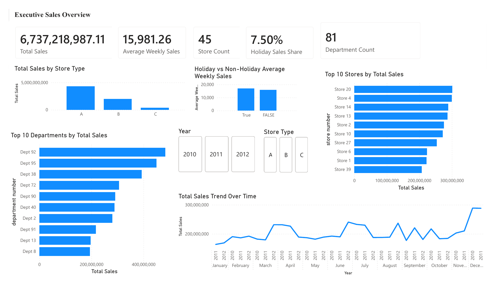
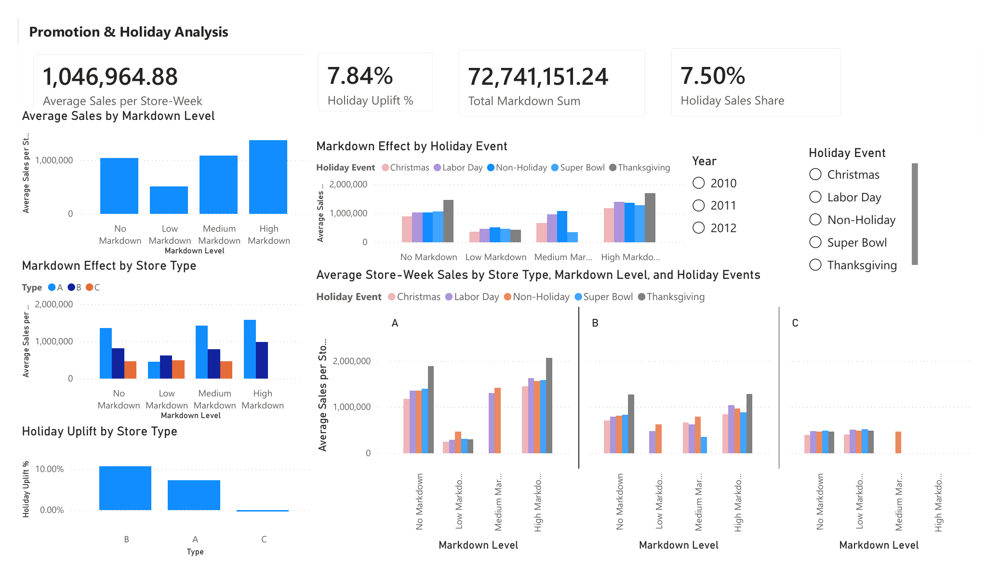
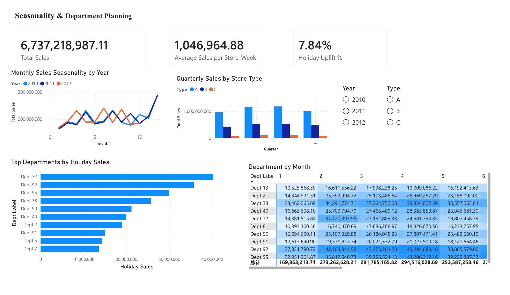
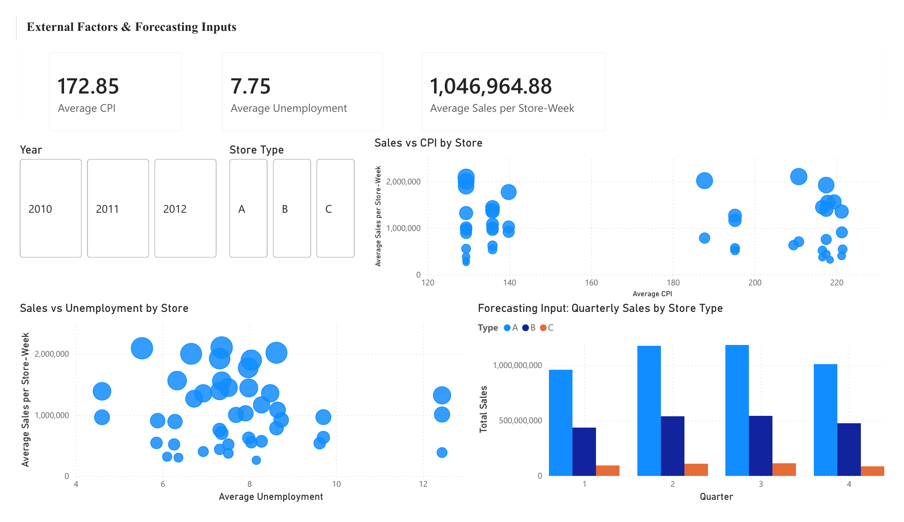

# Walmart Sales Analytics and Forecasting

## Project overview

This project analyzes historical Walmart store and department sales to support decisions about inventory, staffing, promotion timing, and forecasting. The workflow combines data preparation, Power BI dashboard development, descriptive business analysis, and predictive model evaluation.

The analysis was completed as a team project. I completed the full analytical workflow - including data cleaning, feature engineering, dashboard development, model evaluation, and report drafting - and contributed my work to the team's consolidated final submission.

## Business questions

- Which store types, stores, and departments generate the highest sales?
- How do sales differ between holiday and non-holiday weeks?
- How are markdown levels associated with store-week sales?
- Which departments show seasonal or holiday-driven demand patterns?
- Does a regression model improve forecasting accuracy over a historical baseline?

## Data

The project uses the public [Walmart Recruiting - Store Sales Forecasting](https://www.kaggle.com/c/walmart-recruiting-store-sales-forecasting) dataset, including:

- `train.csv`: weekly sales by store, department, and date
- `stores.csv`: store type and size
- `features.csv`: markdowns, CPI, unemployment, temperature, fuel price, and holiday indicators
- `test.csv`: future store-department-date combinations for prediction

Raw competition data is not included in this repository. Please obtain it directly from Kaggle and follow the applicable competition rules.

## Workflow

1. **Data preparation**
   - Converted date fields and created year, month, quarter, and week variables.
   - Built Store-Date and Store-Department keys for merging and forecasting.
   - Combined five markdown fields into a total markdown measure.
   - Used store- and time-aware fallback averages for missing CPI and unemployment values.

2. **Power BI analysis**
   - Built a multi-table data model linking sales, store, and external-feature data.
   - Created DAX measures for total sales, holiday sales share, average store-week sales, and holiday uplift.
   - Developed four dashboard pages covering executive performance, promotions, seasonality, and forecasting inputs.

3. **Predictive modeling**
   - Used a time-based training and validation split.
   - Compared a Store-Department historical-average baseline with a Type A regression model.
   - Evaluated both models using Weighted Mean Absolute Error (WMAE), which assigns higher weight to holiday-week errors.

## Model evaluation

| Model | Validation WMAE | Decision |
|---|---:|---|
| Store-Department historical baseline | 3,048.086 | Selected |
| Type A regression model | 3,211.125 | Diagnostic model |

The baseline produced the lower validation error and was therefore selected for final prediction. The result illustrates why model selection should be based on out-of-sample performance rather than complexity or training R-squared alone.

## Dashboard pages

### 1. Executive sales overview

### 2. Promotion and holiday analysis

### 3. Seasonality and department planning

### 4. External factors and forecasting inputs

## Selected findings

- Total historical sales in the analysis were approximately **$6.74 billion**.
- Holiday weeks showed approximately **7.84% higher average store-week sales** than non-holiday weeks.
- Store Type A generated the largest share of total sales.
- Department 72 generated the highest holiday sales in the dashboard.
- Markdown-sales patterns varied across store types and holiday events; these results are descriptive associations and should not be interpreted as causal effects.

## Tools

- Power BI and DAX
- Microsoft Excel
- Data cleaning and feature engineering
- Regression analysis
- Time-based validation
- WMAE model evaluation

## Limitations

- The regression model focused on Type A stores, so its coefficients should not be generalized to all store types.
- The dataset covers a limited historical period and may not capture structural changes in retail behavior.
- Markdown comparisons are observational and do not establish causal promotion effects.
- A stronger future model could incorporate richer time-series features and additional validation windows.

## Files

- `images/`: dashboard page exports for browser viewing
- `reports/Walmart_Sales_Analytics_Dashboard.pdf`: four-page dashboard export
- `dashboard/Walmart_Sales_Analytics_Dashboard.pbix`: editable Power BI project for private review

> Note: Before making this repository public, consider replacing the PBIX file with a data-free Power BI template (`.pbit`) so the original competition data is not redistributed.

## Author

**Jiarui (Sylvia) Liu**  
Agricultural Economics | Data Science  
Oklahoma State University

